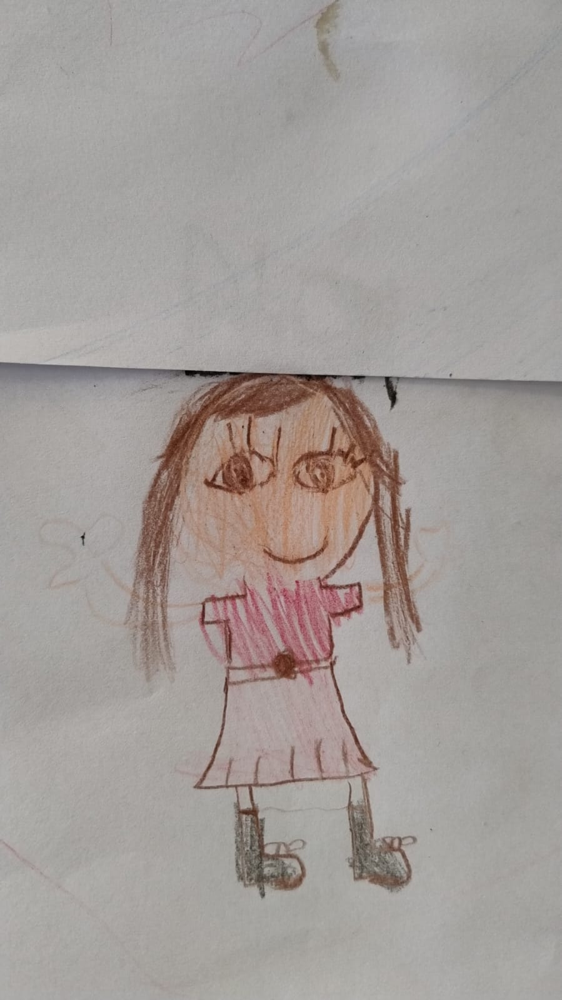
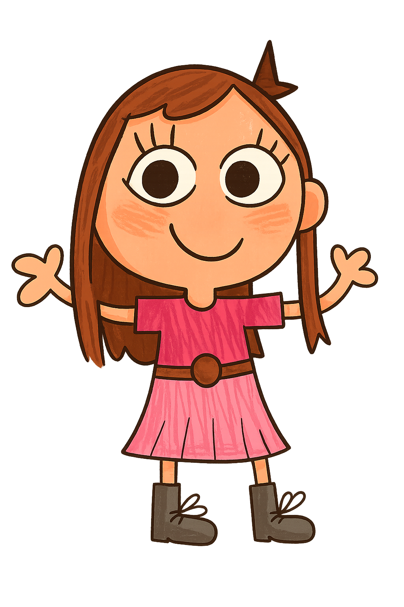

# Didi – A Amiga Virtual da Anna Lua

## Sobre o projeto

A **Didi** nasceu de um pedido especial: criar uma amiga virtual para minha filha, **Anna Lua**, que pudesse ajudá-la tanto no **desenvolvimento acadêmico** quanto em **momentos de brincadeira e criatividade**.

Mais do que um projeto de tecnologia, a Didi é um projeto de amor, educação e imaginação. Ela conversa, propõe atividades, ajuda nos estudos e cria interações lúdicas para acompanhar o crescimento da Anna Lua.

---

## Origem e Identidade Visual

O visual da Didi foi **desenhado pela própria Anna Lua** em papel.  
Usando técnicas de **inteligência artificial generativa**, transformamos esse desenho em uma personagem digital cheia de vida, preservando a essência e a criatividade original.

  
  

Essa identidade visual é parte central do projeto e será **constantemente atualizada** conforme os desejos e novas ideias da Anna Lua, mantendo a Didi sempre próxima da sua criadora.

---

## Tecnologias Utilizadas

A Didi é construída com um ecossistema robusto e escalável, combinando várias tecnologias modernas:

### Backend
- **[Django](https://www.djangoproject.com/)** – Framework Python para desenvolvimento web robusto e seguro.
- Integração com **modelo OpenAI finetuned** para gerar respostas personalizadas e interações únicas.

### Infraestrutura
- **Google Cloud Platform (GCP)** – Hospedagem e serviços na nuvem, garantindo escalabilidade, segurança e disponibilidade.
  - Cloud Run para execução escalável.
  - Cloud Storage para armazenar conteúdos e arquivos.
  - Banco de dados gerenciado.

### Frontend
- **HTML5**, **CSS3** e **JavaScript** puro – Interface leve, rápida e responsiva.
- Design personalizado para criar uma experiência amigável para crianças.

---

## Funcionalidades

- **Assistente de estudos**: ajuda com dúvidas escolares e exercícios.
- **Brincadeiras e jogos educativos**: atividades interativas para estimular a criatividade.
- **Histórias e imaginação**: criação de narrativas personalizadas.
- **Memória adaptativa**: a Didi aprende com as interações para oferecer experiências mais relevantes.

---

## Evolução Contínua

A Didi é um projeto vivo.  
Novas funcionalidades e melhorias serão implementadas **de acordo com as ideias e desejos da Anna Lua**, garantindo que a amiga virtual cresça junto com ela.

---

## ⚖ Licença

Este projeto é protegido por **Licença Proprietária**.  
Todo o código, imagens e design são de propriedade exclusiva de **Lucas Roberto Di Salvo Mello** e **Anna Lua Soares Waichel Di Salvo Mello**.  
Nenhuma parte pode ser utilizada ou reproduzida sem autorização expressa.

---

## Contato

Para dúvidas, sugestões ou solicitações de uso, entre em contato:  
📧 **lrsmello.lucas@gmail.com**

